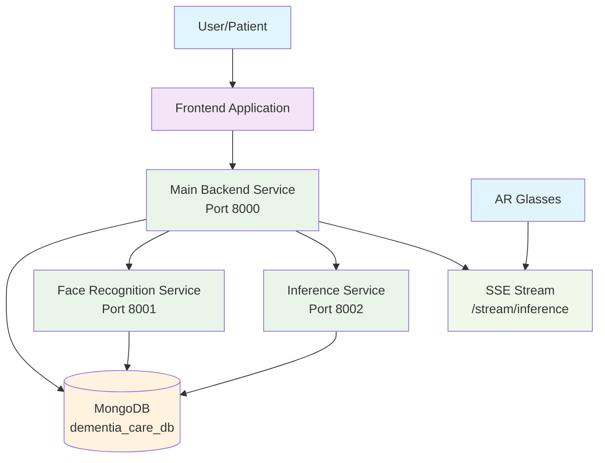
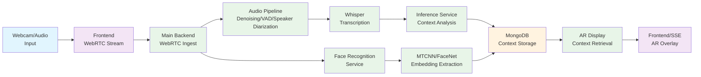

# ForgetMeNot - Dementia Care Assistant System

A multimodal AI system for dementia care that combines real-time audio processing, face recognition, and contextual memory assistance to help patients recognize people in their lives through augmented reality glasses.

## Table of Contents
- [Overview](#overview)
- [Key Features](#key-features)
- [Architecture](#architecture)
- [Data Flow](#data-flow)
- [Technology Stack](#technology-stack)
- [Installation](#installation)
- [Usage](#usage)
- [Services](#services)
- [API Endpoints](#api-endpoints)
- [Face Recognition System](#face-recognition-system)
- [Training and Fine-tuning](#training-and-fine-tuning)
- [Performance Optimization](#performance-optimization)

## Overview

ForgetMeNot is a comprehensive dementia care system that helps patients recognize people in their lives through contextual cues. The system combines real-time audio processing, face recognition, and AI-powered context aggregation to provide meaningful reminders through augmented reality glasses.

The system consists of multiple interconnected services:
1. **Main Backend Service** - Handles WebRTC audio/video streams and core application logic
2. **Face Recognition Service** - Provides real face detection and embedding extraction
3. **Inference Service** - Processes conversation data and generates contextual reminders
4. **Frontend Application** - Web interface for system interaction and AR display simulation

## Key Features

- **Real-time Audio Processing**: WebRTC-based audio streaming with noise reduction, voice activity detection, and speaker diarization
- **Face Recognition**: MTCNN-based face detection and FaceNet-based embedding extraction
- **Multi-Image Enrollment**: Improved recognition accuracy through multiple image captures
- **Contextual Memory Assistance**: AI-powered conversation analysis and context aggregation
- **Augmented Reality Display**: AR glasses simulation for displaying person information
- **Cloud Integration**: Optional cloud-based processing for reduced local CPU load
- **MongoDB Storage**: Persistent storage of person profiles, face embeddings, and conversation history

## Architecture



## Data Flow



## Technology Stack

### Backend
- **Framework**: FastAPI
- **Real-time Communication**: WebRTC (aiortc)
- **Audio Processing**: PyTorch, Whisper, pyannote.audio
- **Database**: MongoDB with PyMongo
- **Face Recognition**: MTCNN, FaceNet (ResNet-50)

### Frontend
- **Framework**: Next.js (React)
- **UI Library**: shadcn/ui, Tailwind CSS
- **Face Detection**: face-api.js
- **Real-time Communication**: WebRTC, Server-Sent Events (SSE)

### Inference & Training
- **AI Platform**: Fireworks.ai
- **Models**: Llama 3.1 8B Instruct (fine-tuned)
- **Data Processing**: Python, NumPy

## Installation

### Prerequisites
- Python 3.10+
- Node.js 18+
- MongoDB (local or remote)
- ffmpeg (required by Whisper)
- Hugging Face account with access to pyannote/embedding

### Environment Setup

1. Create a `.env` file at the project root:
   ```env
   PYANNOTE_AUTH_TOKEN=hf_...
   FIREWORKS_API_KEY=fw_...
   MONGODB_URI=mongodb://localhost:27017
   MONGODB_DATABASE=dementia_care_db
   ```

2. Install main project dependencies:
   ```bash
   pip install -r requirements.txt
   ```

3. Install face recognition service dependencies:
   ```bash
   cd backend/face_recognition_service
   pip install -r requirements.txt
   cd ../..
   ```

4. Install frontend dependencies:
   ```bash
   cd frontend
   npm install
   cd ..
   ```

## Usage

### Starting Services

#### Option 1: Use the startup script (Recommended)
```bash
python start_all_services.py
```

#### Option 2: Start services manually

Terminal 1: Face Recognition Service
```bash
cd backend/face_recognition_service
python main.py
```

Terminal 2: Main Backend
```bash
python -m uvicorn backend.app.main:app --reload --port 8000
```

Terminal 3: Inference Service
```bash
cd inference
python main.py
```

Terminal 4: Frontend
```bash
cd frontend
npm run dev
```

Visit `http://localhost:3000/`, allow camera/mic access, and monitor the server logs.

## Services

### Main Backend Service (Port 8000)

Handles WebRTC audio/video ingestion, face recognition integration, and person management.

#### Key Components:
- WebRTC ingress for real-time audio/video
- Audio pipeline with denoising, VAD segmentation, speaker embedding
- Whisper transcription
- MongoDB Atlas vector-store integration
- Face recognition service integration
- Person profile management

### Face Recognition Service (Port 8001)

Provides real face detection and embedding extraction using state-of-the-art models.

#### Features:
- Face detection using MTCNN
- Face embedding extraction using FaceNet (ResNet-50)
- Multi-image enrollment support for better accuracy
- Model version tracking

### Inference Service (Port 8002)

Processes conversation data and generates contextual reminders for AR display.

#### Key Functions:
- Consumes conversation events from main backend
- Aggregates conversation context using AI models
- Generates AR display descriptions
- Streams results via Server-Sent Events

## API Endpoints

### Main Backend Service (Port 8000)

| Endpoint | Method | Description |
|----------|--------|-------------|
| `/` | GET | Main frontend interface |
| `/stream/inference` | GET | SSE stream of person detection events |
| `/ws/audio` | WebSocket | Audio streaming endpoint |
| `/person` | POST | Create new person |
| `/person/{person_id}` | PUT | Update existing person |
| `/people` | GET | List all people |
| `/face/embedding` | POST | Store face embedding for a person |
| `/face/recognize` | POST | Recognize person by face embedding |

### Face Recognition Service (Port 8001)

| Endpoint | Method | Description |
|----------|--------|-------------|
| `/health` | GET | Service health check |
| `/extract_embedding` | POST | Extract face embedding from image |

### Inference Service (Port 8002)

| Endpoint | Method | Description |
|----------|--------|-------------|
| `/` | GET | Service information |
| `/health` | GET | Health check with queue status |
| `/stream/inference` | GET | SSE stream of processed inference results |

## Face Recognition System

### Technical Details

The face recognition system uses a production-ready implementation with:

1. **Face Detection**: MTCNN for accurate face detection
2. **Face Alignment**: Crops and resizes faces to 160x160 pixels
3. **Embedding Extraction**: ResNet-50 backbone to generate 128-dimensional embeddings
4. **Model Versioning**: Tracks model version for future compatibility

### Multi-Image Enrollment

For improved recognition accuracy, the system supports multi-image enrollment:

1. **Capture**: Users can capture 3-5 images from different angles
2. **Processing**: Each image is processed to extract face embeddings
3. **Averaging**: Embeddings are averaged to improve recognition accuracy
4. **Storage**: Averaged embedding is stored with model version information

### Error Handling

1. **Model Loading**: Graceful fallback when face-api.js models fail to load
2. **Network Errors**: Proper error messages for service connectivity issues
3. **Validation**: Input validation for all API endpoints
4. **Logging**: Comprehensive logging for debugging and monitoring

## Training and Fine-tuning

### Context Aggregation Model

The system uses fine-tuned LLMs for context processing:

**Purpose**: Takes previous context + current conversation and outputs updated detailed context

**Training Process**:
1. Generate synthetic training data (990 examples)
2. Upload dataset to Fireworks.ai
3. Create fine-tuning job
4. Monitor until completion
5. Integrate fine-tuned model into inference service

### AR Display Model

Generates concise, actionable descriptions for AR display:

**Purpose**: Takes person name, relationship, and verbose context and outputs one-line specific description

**Features**:
- Focus on specific, memorable details
- Include time references
- Keep to one sentence (15-20 words)
- No person name or relationship in output

## Performance Optimization

### For Lower-End Hardware (i3 Laptops)

The application includes several optimizations:
- Reduced sample rate (8kHz instead of 16kHz)
- Limited concurrent sessions to 1
- Reduced minimum conversation time
- Cloud-based AI processing when credentials are available

### Cloud Services

Optional cloud-based processing to reduce CPU load:
1. **Hugging Face API**: Used for speaker embedding models (pyannote/embedding)
2. **Fireworks.ai API**: Used for Whisper speech-to-text transcription

When API keys are provided, heavy AI processing is offloaded to cloud services, making the application much more responsive on lower-end hardware.

## Future Improvements

1. **GPU Acceleration**: Add CUDA support for faster inference
2. **Advanced Models**: Implement ArcFace or InsightFace for better accuracy
3. **Model Caching**: Cache models for faster loading
4. **Batch Processing**: Process multiple faces in a single image
5. **Real-time Recognition**: Implement real-time face recognition in video streams